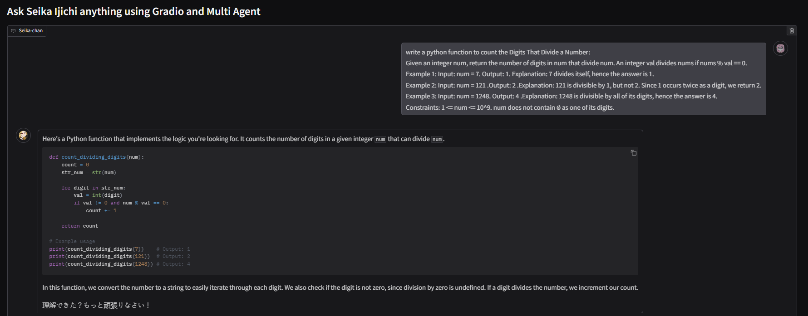

# Multi-Agent Conversation: Anime Girl Chatbot (Seika Ijichi)

This project demonstrates a multi-agent chatbot using Gradio, AutoGen, and OpenAI’s API. You will chat with **Seika Ijichi**, a proud but kind anime girl who can respond in English, Vietnamese, and occasionally in Japanese.

## Features
- Role-play as an anime girl (tsundere personality).
- Supports conversation in English or Vietnamese, with some Japanese phrases sprinkled in.
- Show file functionality to display or read files (e.g., images, text files).
- Simple Gradio UI with text input and chat display.

## Getting Started

### 1. Install Dependencies
Make sure you have Python 3.8+ installed. Then install all requirements:

```bash
pip install -r requirements.txt
```

### 2. Set OpenAI Key
Put your OpenAI API key (you can register and get api_key from 'https://platform.openai.com/api-keys' then paste it) in **`OAI_CONFIG_LIST.json`**. The file should look like this:

```json
[
  {
    "api_key": "sk-xxxxxxxxxxxxxxxxxxxxxxxxxxxxxxxxxxxxx"
  }
]
```

Replace `"sk-xxxxxxxxxx..."` with your actual OpenAI API key.

### 3. Run the App
To start the application, run:

```bash
python app.py
```

### 4. Open the Local URL
After running the command above, Gradio will display a local URL in your console (something like `http://127.0.0.1:7860`).  
Click or copy-paste that link into your browser to open the chatbot interface.


### 5. Start Chatting
Ask anything! Seika Ijichi will reply to your questions with her tsundere flair. You can type in English or Vietnamese, and she’ll respond accordingly. She’ll occasionally use Japanese phrases.



The agent will automatic run the code (until the correct output is obtained).


Enjoy your conversation with the anime girl chatbot!

---

**Note:** If you want to share your app publicly, you can set `share=True` in the `demo.launch()` call within `app.py`. For example:

```python
if __name__ == "__main__":
    demo.launch(share=True)
```

This will generate a shareable link that you can give to others to try out your chatbot online.
